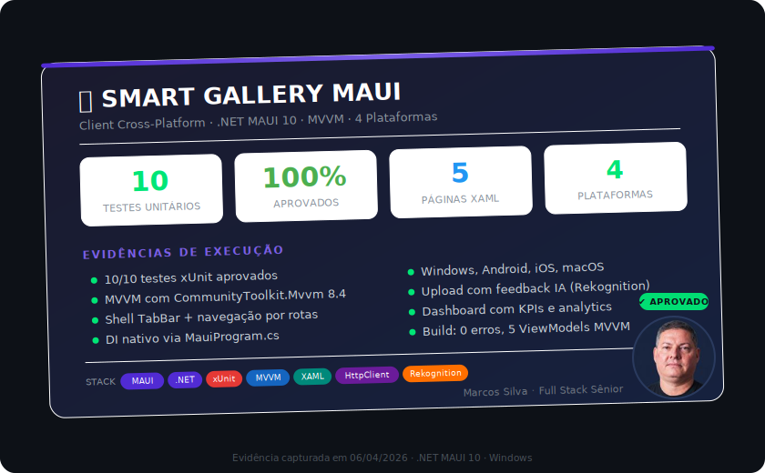

# Smart Gallery Viewer — .NET MAUI Client

[](https://dotnet.microsoft.com/apps/maui)
[]()
[]()
[](https://github.com/masilvaarcs/smart-gallery-aws)

> **Cliente cross-platform** para o [Smart Gallery AWS](https://github.com/masilvaarcs/smart-gallery-aws) — galeria de imagens serverless com auto-tagging via Amazon Rekognition.

---

## 🏗️ Parte de um Ecossistema

Este projeto faz parte de uma arquitetura de dois repositórios:

| Repositório | Stack | Responsabilidade |
|---|---|---|
| [**smart-gallery-aws**](https://github.com/masilvaarcs/smart-gallery-aws) | .NET 8 · Lambda · S3 · DynamoDB · Rekognition | API serverless + IA auto-tagging |
| **smart-gallery-maui** (este) | .NET MAUI 10 · MVVM · CommunityToolkit | Cliente cross-platform |

```
┌─────────────────────┐         ┌──────────────────────────────┐
│  Smart Gallery MAUI │ ──────► │     Smart Gallery AWS        │
│  (.NET MAUI 10)     │  HTTPS  │  (Lambda + API Gateway)      │
│                     │         │         │                    │
│  📱 Windows         │         │    ┌────┴────┐               │
│  📱 Android         │         │    │ Rekognition (IA tags)   │
│  📱 iOS             │         │    │ S3 (imagens)            │
│  📱 macOS           │         │    │ DynamoDB (metadados)    │
└─────────────────────┘         └────┴─────────────────────────┘
```

---

## ✨ Funcionalidades

### 📷 Galeria de Imagens
- Grid responsivo com thumbnails
- Busca por tags ou título
- Paginação automática (infinite scroll)

### 🚀 Upload com IA
- Seleção de imagens da galeria do dispositivo
- Captura direta da câmera
- Tags manuais + **auto-tagging via Amazon Rekognition**
- Feedback visual dos tags detectados pela IA

### 🔍 Visualização Detalhada
- Imagem em alta resolução
- Metadados completos: resolução, tamanho, formato
- Lista de todas as tags (manuais + IA)
- Exclusão com confirmação

### 📊 Dashboard Analytics
- KPIs: total de imagens, armazenamento, formatos
- Distribuição por formato (barras visuais)
- Ranking de tags mais populares

### ⚙️ Configurações
- URL da API configurável
- Teste de conexão integrado
- Persistência local via `Preferences`

### 🔐 Privacidade e LGPD
- Confirmacao explicita antes do upload de imagem
- Mensagens de erro sanitizadas para nao expor detalhes internos
- Guia operacional em `docs/PRIVACIDADE_E_LGPD.md`

---

## 🛠️ Stack Tecnológica

| Camada | Tecnologia |
|---|---|
| Framework | .NET MAUI 10 |
| Arquitetura | MVVM (Model-View-ViewModel) |
| Source Generators | CommunityToolkit.Mvvm 8.4 |
| HTTP | HttpClient + System.Text.Json |
| Navegação | Shell (TabBar + rotas) |
| Testes | xUnit + MockHttpHandler (10 testes) |

### Por que .NET MAUI?
- **Uma codebase** → Windows, Android, iOS, macOS
- **Ecossistema unificado** com o backend .NET
- **MVVM nativo** com source generators (zero boilerplate)
- **Performance nativa** (não é WebView)

---

## 🚀 Como Usar

### ⚡ Início Rápido (API já deployada na AWS)

O backend já está rodando. Para ver tudo funcionando em menos de 2 minutos:

```powershell
# 1. Instalar workload MAUI (apenas na primeira vez)
dotnet workload install maui

# 2. Clonar e rodar
git clone https://github.com/masilvaarcs/smart-gallery-maui.git
cd smart-gallery-maui/src/SmartGallery.Maui
dotnet run -f net10.0-windows10.0.19041.0
```

```
# 3. Quando o app abrir, vá em Config e cole a URL da API:
https://klgigkovh8.execute-api.us-east-1.amazonaws.com/prod
```

Clique em **Testar Conexão** — deve retornar `healthy`. Pronto, o app está conectado à galeria na AWS.

---

### Pré-requisitos
- [.NET 10 SDK](https://dot.net) (`dotnet --version` ≥ 10.0)
- Workload MAUI: `dotnet workload install maui`
- Windows 10 versão 1903 ou superior (para target `windows10.0.19041.0`)

### Executar (Windows)
```powershell
cd src/SmartGallery.Maui
dotnet run -f net10.0-windows10.0.19041.0
```

### Configurar API
1. Abra a aba **Config** no app
2. Cole a URL da API:
   ```
   https://klgigkovh8.execute-api.us-east-1.amazonaws.com/prod
   ```
3. Clique em **Testar Conexão** — deve retornar `healthy` ✅
4. A galeria carrega automaticamente

### Executar Testes
```powershell
cd tests/SmartGallery.Maui.Tests
dotnet test --verbosity normal
# Test summary: total: 10; failed: 0; succeeded: 10; skipped: 0
```

---

## 📁 Estrutura

```
smart-gallery-maui/
├── src/SmartGallery.Maui/
│   ├── Models/           # DTOs (espelho da API)
│   ├── Services/         # GalleryApiService, SettingsService
│   ├── ViewModels/       # MVVM com CommunityToolkit
│   ├── Views/            # XAML Pages (Gallery, Upload, Detail, Dashboard, Settings)
│   ├── Converters/       # Value converters
│   ├── MauiProgram.cs    # DI + configuração
│   └── AppShell.xaml     # Navegação (TabBar)
├── tests/SmartGallery.Maui.Tests/
│   └── GalleryApiServiceTests.cs  # 10 testes
├── .gitignore
└── README.md
```

---

## 📈 Métricas

| Métrica | Valor |
|---|---|
| Testes | 10 |
| Páginas | 5 (Gallery, Upload, Detail, Dashboard, Settings) |
| ViewModels | 5 |
| Plataformas | 4 (Windows, Android, iOS, macOS) |
| Dependências | 2 (CommunityToolkit.Mvvm, Microsoft.Maui) |

---

## 📸 Evidências de Build e Testes



---

## �️ Showcase — Veja o App em Ação

> **Quer ver screenshots reais do Smart Gallery funcionando?**

| Recurso | Descrição |
|---|---|
| 📖 [**SHOWCASE.md**](docs/SHOWCASE.md) | Galeria de capturas com explicações detalhadas |
| 🎨 [**SHOWCASE interativo**](docs/SHOWCASE.html) | Versão HTML com recortes estilizados e animações |

Inclui: tema escuro e claro, upload com IA, detalhes com tags Rekognition, dashboard de analytics.

---

## �🔗 Projetos Relacionados

- 🔙 **Backend**: [smart-gallery-aws](https://github.com/masilvaarcs/smart-gallery-aws) — API serverless .NET 8 + Lambda + Rekognition

---

## 📄 Licença

MIT
