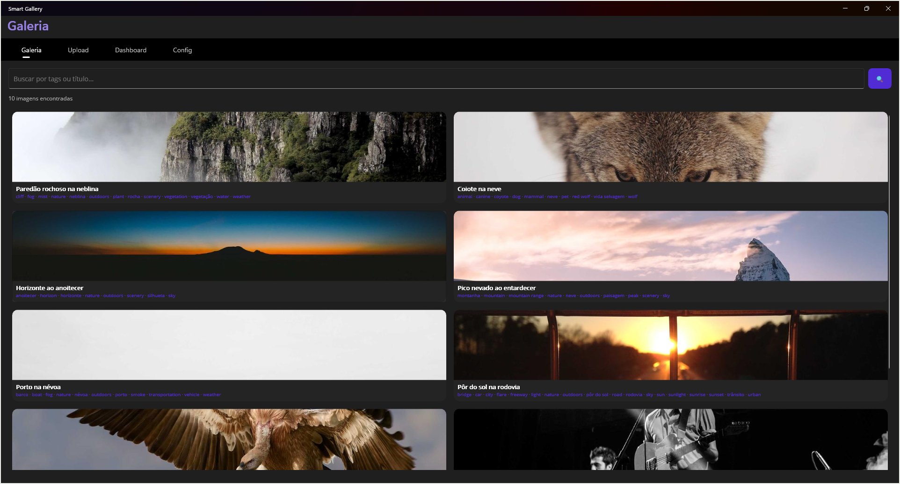
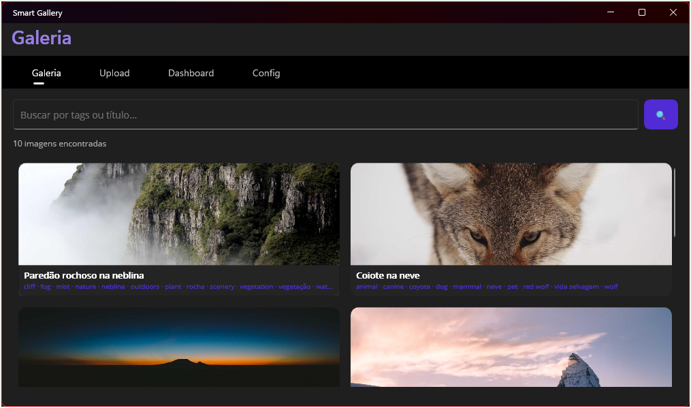
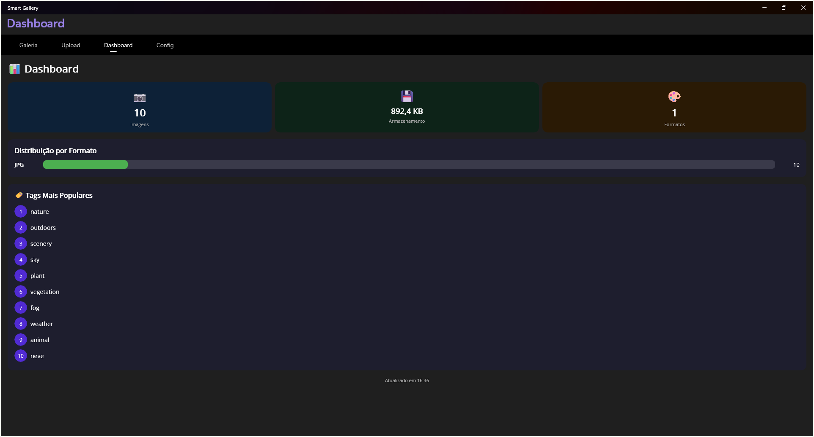
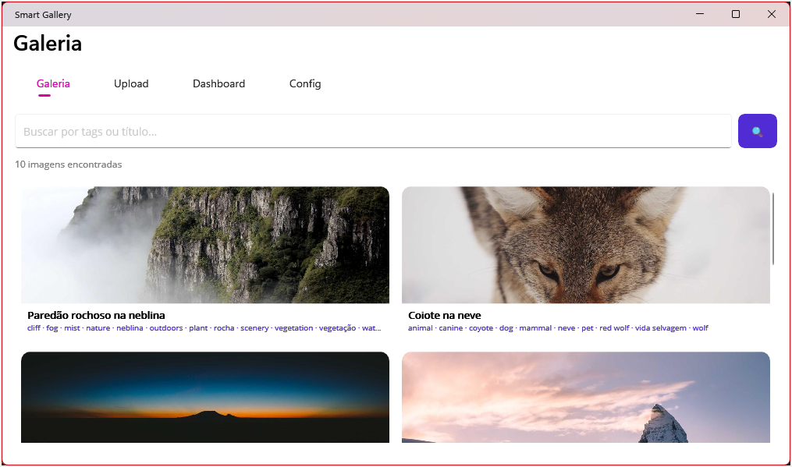
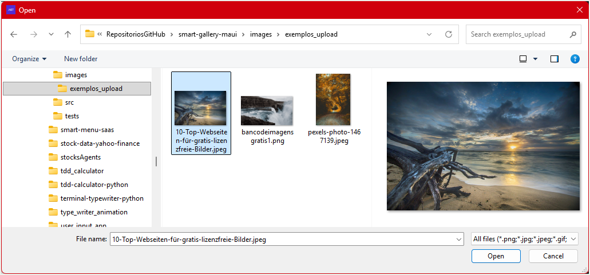
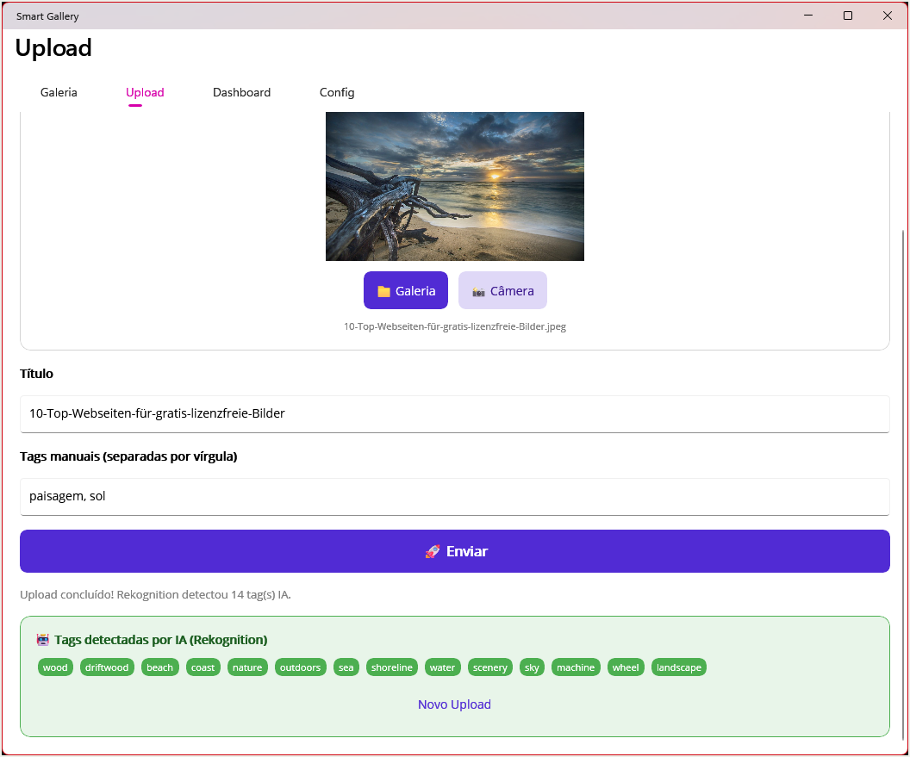
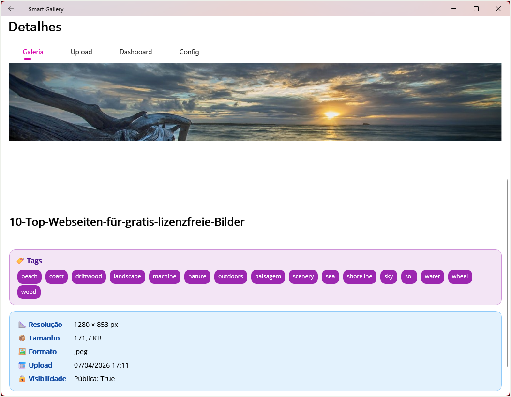
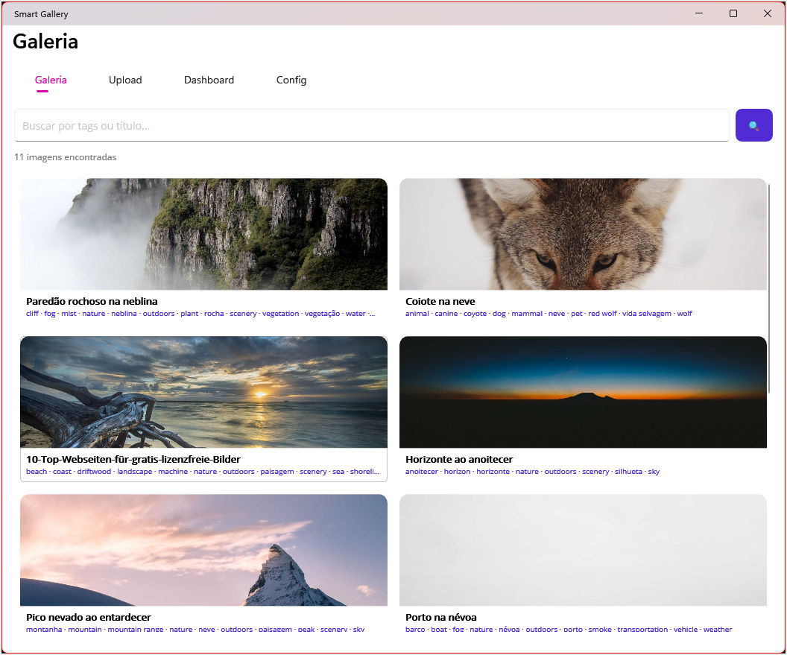
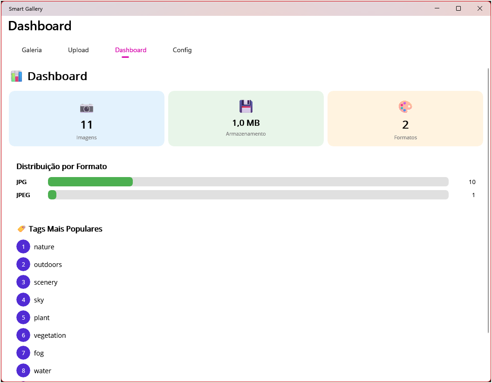

# 📸 Smart Gallery — Showcase Visual

> Capturas reais do Smart Gallery rodando com a API na AWS.
> Para uma experiência visual completa, abra o [**SHOWCASE interativo (HTML)**](SHOWCASE.html).

---

## 🌑 Tema Escuro

### Galeria — Grid de Imagens com Tags IA

  

> 10 imagens carregadas via API. Cada card exibe tags geradas automaticamente pelo **Amazon Rekognition** (nature, fog, scenery, animal, etc.)

---

### Galeria — Visualização Compacta

  

---

### Dashboard — Analytics em Tempo Real

  

> **KPIs:** 10 imagens · 892,4 KB · 1 formato | **Top tags IA:** nature, outdoors, scenery, sky, plant

---

## ☀️ Tema Claro

### Galeria — Grid de Imagens

  

---

### Upload — Seleção de Arquivo

  

> File picker nativo do Windows, acessando a pasta `exemplos_upload` com imagens de demonstração.

---

### Upload — Enviando para a API

  

---

### Detalhes — Tags de IA Detectadas

  

> **Tags automáticas (Rekognition):** beach · coast · driftwood · landscape · machine · nature · outdoors · paisagem · scenery · sea · shoreline · sky · sol · water · wheel · wood
>
> **Metadados:** 1280 × 853 px · 171,7 KB · JPEG · Upload em 07/04/2026

---

### Galeria — Após Upload (nova imagem na listagem)

  

---

### Dashboard — Atualizado após Upload

  

> **Após upload:** 11 imagens · 1,0 MB · 2 formatos (JPG + JPEG) | Tags nature e outdoors liderando

---

## 🔗 Links

| Recurso | Link |
|---|---|
| **Backend (API + AWS)** | [smart-gallery-aws](https://github.com/masilvaarcs/smart-gallery-aws) |
| **Frontend (MAUI)** | [smart-gallery-maui](https://github.com/masilvaarcs/smart-gallery-maui) |
| **Showcase Interativo** | [Abrir SHOWCASE.html](SHOWCASE.html) |
| **Portfólio** | [masilvaarcs.github.io/portfolio-hub](https://masilvaarcs.github.io/portfolio-hub/) |
| **LinkedIn** | [linkedin.com/in/marcosprogramador](https://www.linkedin.com/in/marcosprogramador/) |
